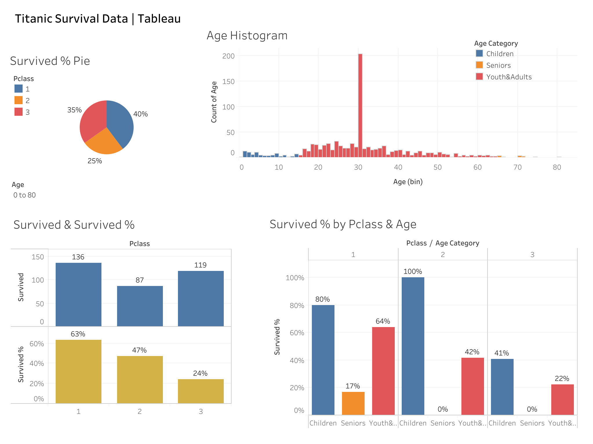

## Step 1. Kick-off meeting with management

Imagine you work for a company that builds ships and wants to investigate the Titanic tragedy to improve their designs. They aim to ensure that in emergencies, all passengers, regardless of class and age, have equal access to emergency exits and equipment. The team suspects that higher-class passengers on the Titanic had higher survival chances, and wants you to visualize the data to verify this suspicion.

---

## Step 2. Documenting a task during a meeting

**Goal**: See if survival rate had anything to do with the passangers within each class to identify vulnerable age categories.

---

## Tools Used

- Python
- Pandas
- Excel

---

## What This Project Does

1. Loads raw `.csv` coffee sales data into a Pandas DataFrame
2. Cleans the data by:
   - Removing missing values
   - Dropping duplicates
   - Cleaning column names (stripping spaces, making lowercase)
4. Exports the cleaned data to an Excel file

---
[Link Tableau](https://public.tableau.com/views/TitanicSurvivalData_17490896883030/TitanicSurvivalDashboard?:language=en-US&:sid=&:redirect=auth&:display_count=n&:origin=viz_share_link)

---

**Assessment**: The data analytics dashboard highlights notable disparities in survival outcomes across the Titanic's passanger classes.  A closer look at the survival percentages reveals that first-class passangers were nearly three times more likely to survive than those in third class. This indicates the importance of evaluating survival rates by class rather than focusing soley on the absolute number of survivors.

For instance, while approximately 60% of first-class passangers survived overall, the proportion of survivors within that class was signifficantly higher. This distinction highlights the need to separate overall survival rates from class-specific survival proportions when drawing conclusion.

Age also had marked impact on survival.  All children in second class survived, compared to 80% in first class and just 40% in third class. Among elderly passangers, none from the second or third class survived, and only one senior in first class did, representing a survival rate of roughly 17%. Further statistical testing is recommended to deteremine whether the low survival rate among seniors reflects a significant trend or random variation.

**Quick Summary Notes**:
- First-class passengers were nearly 3x more likely to survive than third-class.

- It's important to look at survival rates by class, not just total survivor counts.

- ~60% of first-class passengers survived overall, but class-specific survival rates were even higher.

- All children in second class survived.

- Child survival rates:

  - 2nd class = 100%

  - 1st class = 80%

  - 3rd class = 40%

- No elderly survivors in 2nd or 3rd class.

- Only one elderly person survived in 1st class (~17% survival rate).

- Recommend statistical testing to check if senior survival differences are significant or random.# titanic-analysis
